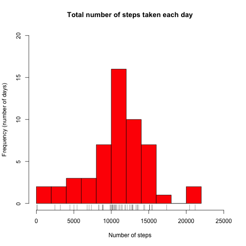
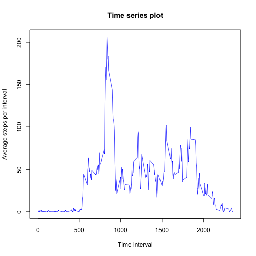
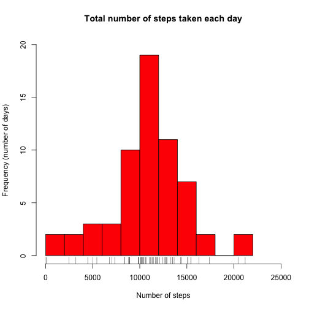
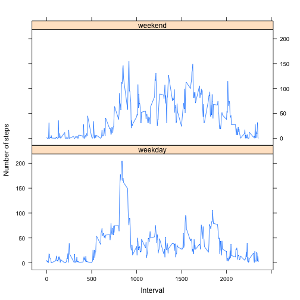
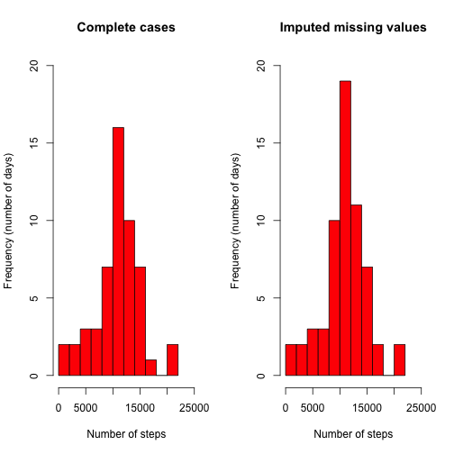

Reproducible research - Peer assessment (1)
========================================================


## Loading and preprocessing the data


```r
data <- read.csv("activity.csv", header = TRUE, na.strings = c("NA"), comment.char = "")
## The number of days in the data before any processing is 61 days (date
## variable is 61 levels)
data[, 2] <- as.Date(data[, 2], "%Y-%m-%d")
data$interval <- as.factor(data$interval)
```


**There are three major parts of this assignment:**
* The *first part* which only deals with complete cases
* The *second part* which deals with the full dataset after imputing all the missing values
* The *third part* which compares between the results of the first the and the second part

## Part-1 (Only complete cases): 
In this part, the dataset will be processed by removing any row with a missing value of the variable steps. Please remember that if the date variable isn't converted to date and remains as a factor, you need to drop unused levels by using droplevels command.

## What is mean total number of steps taken per day?

The number of days in the completed_data, after removing cases with missing values, is 53 days (8 days had no recorded value at any interval).
To calculate the mean of the total number of steps per day, run the following code:


```r
completed_data <- data[complete.cases(data$steps), ]
mean_steps = sum(completed_data$steps)/53  ## 8 days out of 61 have only missing values 
print(mean_steps)
```

```
## [1] 10766
```


Considering complete cases only, the mean total number of steps taken per day is 1.0766 &times; 10<sup>4</sup>.

## What is the average daily activity pattern?

To make a histogram of the total number of steps taken each day:


```r
completed_data_list <- split(completed_data$steps, completed_data$date)  ## Generate a list based on date
sumperday <- sapply(completed_data_list, sum)  ## Calculate the sum steps per day
hist(sumperday, col = "red", breaks = 12, ylim = c(0, 20), xlim = c(0, 25000), 
    main = "Total number of steps taken each day", xlab = "Number of steps", 
    ylab = "Frequency (number of days)")
rug(sumperday)
```

 


To calculate and report the mean and median total number of steps taken per day:


```r
print(mean(sumperday))  ## Mean number of steps per day (complete cases)
```

```
## [1] 10766
```


Considering complete cases only, the mean number of steps per day is 1.0766 &times; 10<sup>4</sup>.


```r
print(median(sumperday))  ## Median steps per day (complete cases)
```

```
## [1] 10765
```


Considering complete cases only, the median number of steps per day is 10765.

It's very interesting to notice that the mean and the median number of steps per day are very close.

To make a time series plot (i.e. type = "l") of the 5-minute interval (x-axis) and the average number of steps taken, averaged across all days (y-axis):

```r
Interval <- as.numeric(as.character(completed_data[1:288, 3]))  ## Create a vector of the 5-minutes intervals in order to allow latter plotting as a line
completed_data_list <- split(completed_data$steps, completed_data$interval)  ## Generate a list based on interval
meanperinterval <- sapply(completed_data_list, mean)  ## Calculate the mean steps per interval
meanperinterval <- as.data.frame(meanperinterval)  ## Convert to dataframe
meanperinterval <- cbind(Interval, meanperinterval)  ## Append the Interval numeric vector
plot(meanperinterval ~ Interval, data = meanperinterval, col = "blue", type = "l", 
    main = "Time series plot", xlab = "Time interval", ylab = "Average steps per interval")
```

 


To find out which 5-minute interval, on average across all the days in the dataset, contains the maximum number of steps:


```r
ordered <- meanperinterval[order(meanperinterval$meanperinterval), , drop = FALSE]
maximum_number_of_steps_interval <- tail(ordered[, 1], 1)
print(maximum_number_of_steps_interval)
```

```
## [1] 835
```


The 5-minute interval, on average across all the days in the dataset, that contains the maximum number of steps is interval 835.


## Part-2 (Dataset with imputed missing values):

## Imputing missing values

To calculate and report the total number of missing values in the dataset (i.e. the total number of rows with NAs):


```r
missing <- is.na(data$steps)
n.missing <- sum(missing)
print(n.missing)
```

```
## [1] 2304
```


The number of missing values is 2304.

The chosen imputation strategy is random sampling of the missing values from the non-missing values within the dataset. Then generate a new dataset called imputed_data which is equal in size to the original dataset and with random sampled missing values:


```r
a.obs <- data$steps[!missing]  ## Generate a vector of the non-missing values
imputed_steps <- data$steps
set.seed(3456)  ## To allow reproducibility
imputed_steps[missing] <- sample(a.obs, n.missing, replace = TRUE)  ## Random sampling
imputed_data <- cbind(imputed_steps, data)  ## New dataset with imputed missing values
```


To make a histogram of the total number of steps taken each day:


```r
imputed_data_list <- split(imputed_data$imputed_steps, data$date)  ## Generate a list based on date
imputed_sumperday <- sapply(imputed_data_list, sum)  ## Calculate the sum steps per day
hist(imputed_sumperday, col = "red", breaks = 12, ylim = c(0, 20), xlim = c(0, 
    25000), main = "Total number of steps taken each day", xlab = "Number of steps", 
    ylab = "Frequency (number of days)")
rug(imputed_sumperday)
```

 


To calculate and report the mean and median total number of steps taken per day:


```r
print(mean(imputed_sumperday))  ## Mean number of steps per day (imputed dataset)
```

```
## [1] 10842
```


Considering imputet dataset, the mean number of steps per day is 1.0842 &times; 10<sup>4</sup>.


```r
print(median(imputed_sumperday))  ## Median steps per day (imputed dataset)
```

```
## [1] 11015
```


Considering imputet dataset, the mean number of steps per day is 11015.


## Are there differences in activity patterns between weekdays and weekends?

To create a new factor variable in the dataset with two levels – “weekday” and “weekend” indicating whether a given date is a weekday or weekend day:


```r
day <- as.factor(weekdays(imputed_data$date))  ## Levels of day factor: Friday Monday Saturday Sunday Thursday Tuesday Wednesday
imputed_data <- cbind(day, imputed_data)
dayclass <- day
levels(dayclass) <- c("weekday", "weekday", "weekend", "weekend", "weekday", 
    "weekday", "weekday")  ## Levels of dayclass: weekday weekend
imputed_data <- cbind(dayclass, imputed_data)  ## An updated dataset with the dayclass variable
```


To make a panel plot containing a time series plot (i.e. type = "l") of the 5-minute interval (x-axis) and the average number of steps taken, averaged across all weekday days or weekend days (y-axis):


```r
imputed_data_list <- split(imputed_data$imputed_steps, list(imputed_data$interval, 
    imputed_data$dayclass))  ## Generate an interaction factor between the interval and the dayclass
meanperinterval <- sapply(imputed_data_list, mean)  ## calculate the mean per interaction level
meanperinterval <- as.data.frame(meanperinterval)  ## Convert to dataframe
dayclass <- gl(2, 288)
levels(dayclass) <- c("weekday", "weekend")
meanperinterval <- cbind(Interval, dayclass, meanperinterval)  ## append two columns; one for the interval and the other for the dayclass
library(lattice)
xyplot(meanperinterval ~ Interval | dayclass, data = meanperinterval, type = "l", 
    ylab = "Number of steps", layout = c(1, 2))
```

 

## Part-3 (Comparison): 

To compare the total number of steps taken each day plotted as a histogram in both cases:

```r
par(mfrow = c(1, 2))
hist(sumperday, col = "red", breaks = 12, ylim = c(0, 20), xlim = c(0, 25000), 
    main = "Complete cases", xlab = "Number of steps", ylab = "Frequency (number of days)")
hist(imputed_sumperday, col = "red", breaks = 12, ylim = c(0, 20), xlim = c(0, 
    25000), main = "Imputed missing values", xlab = "Number of steps", ylab = "Frequency (number of days)")
```

 


To compare the mean and the median number of steps per day in both cases:


```r
print(mean(sumperday))  ## Mean number of steps per day (complete cases)
```

```
## [1] 10766
```

```r
print(median(sumperday))  ## Median steps per day (complete cases)
```

```
## [1] 10765
```

```r
print(mean(imputed_sumperday))  ## Mean number of steps per day (imputed dataset)
```

```
## [1] 10842
```

```r
print(median(imputed_sumperday))  ## Median steps per day (imputed dataset)
```

```
## [1] 11015
```


